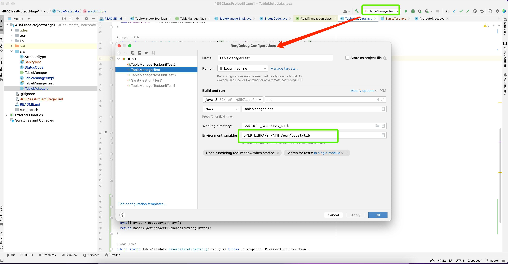

# ClassProject: Part 1

Read https://docs.google.com/document/d/1bcVmORBZQvRv4FGLuRuJzMwB_UIq-pULvMXOFhlfNwU/edit?usp=sharing for the description of the project.

## How to run the test on Linux and MacOS
```shell
bash run_test.sh
```


If you experience some link error on MacOS, add this environment variable

```
DYLD_LIBRARY_PATH=/usr/local/lib
```

Here's how you can add the environment variable in IntelliJ


